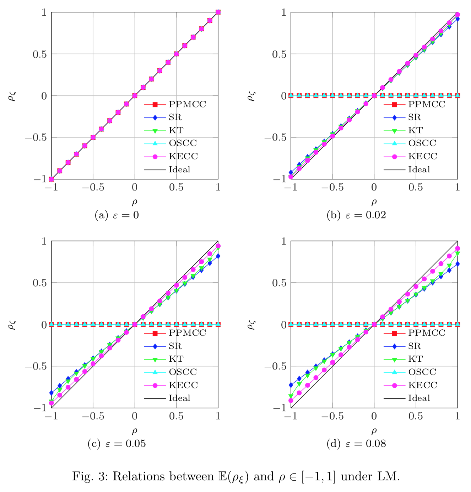
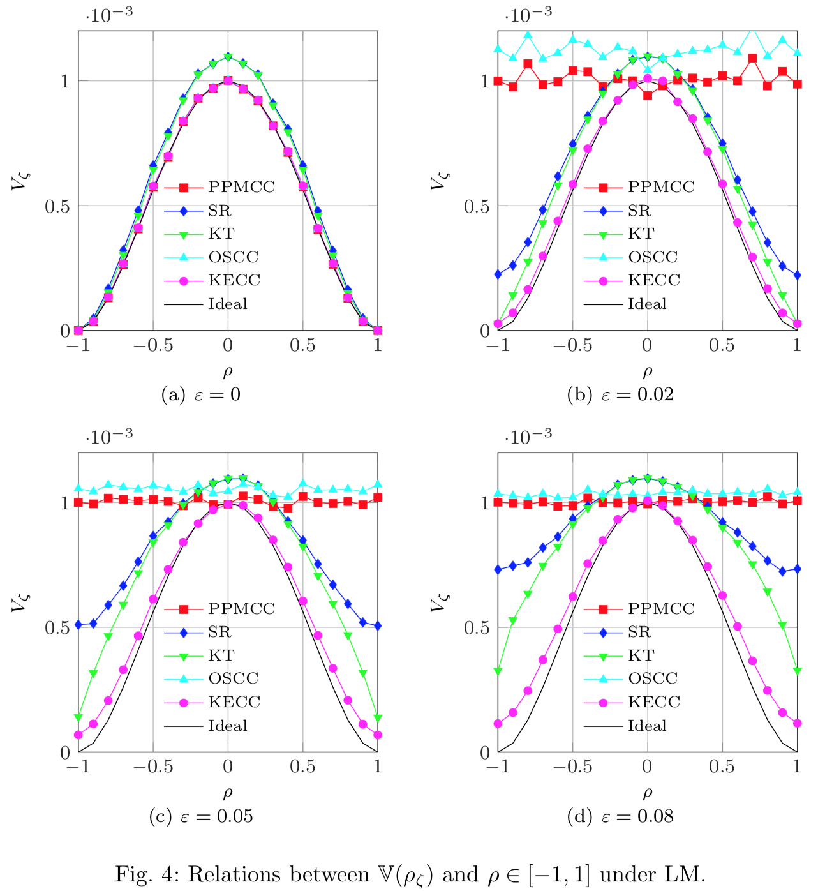

# KECC: Kernel Correlation Coefficient
Code for 'A Novel Kernel Correlation Coefficient with Robustness Against Nonlinear Attenuation and Impulsive Noise'.

# Using
Using function 'kernel_ppmcc' like  function 'corr' in Matalb.

# Result
 
 

 ## Citation

```
@article{KECC,
  author    = {Weichao Xu, Baojun Li, Rubao Ma, Yanzhou Zhou and Yun Zhang},
  title     = {A Novel Kernel Correlation Coefficient with Robustness Against Nonlinear Attenuation and Impulsive Noise},
  journal   = {Journal of Signal Processing Systems}, 
  volume    = {89}, 
  pages     = {395-413},
  year      = {2017},
  publisher = {Springer}
}
```